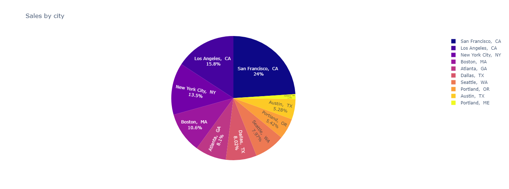
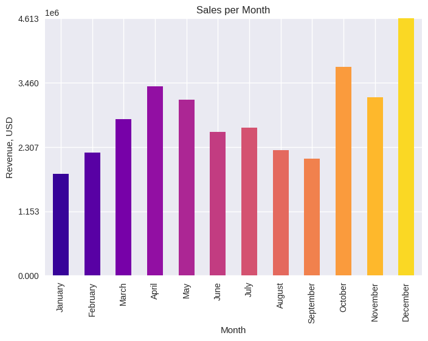
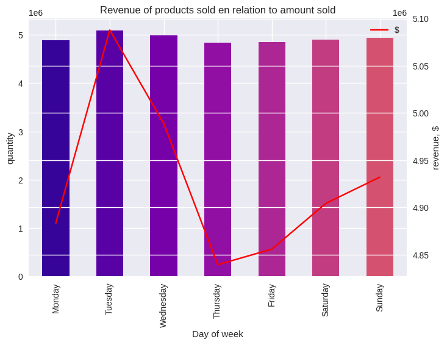
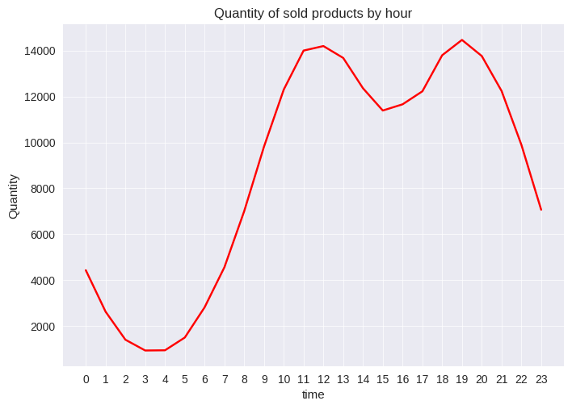
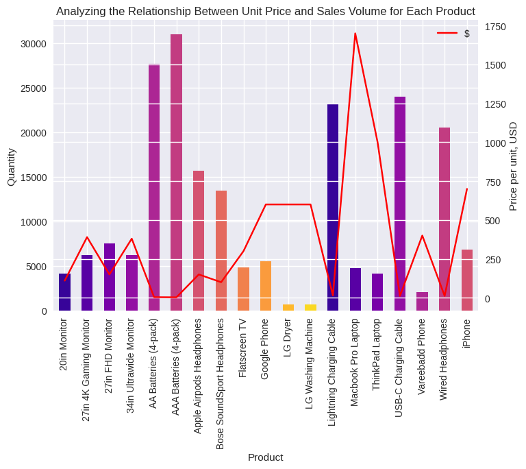
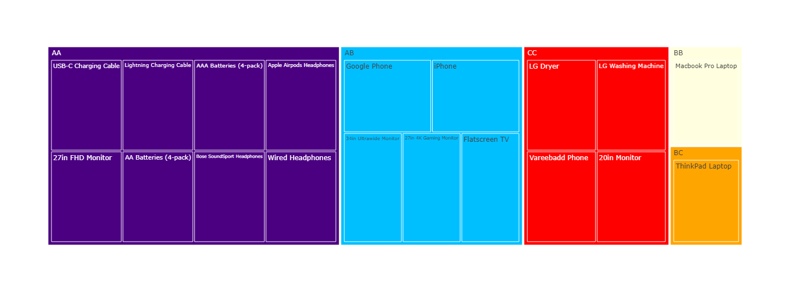
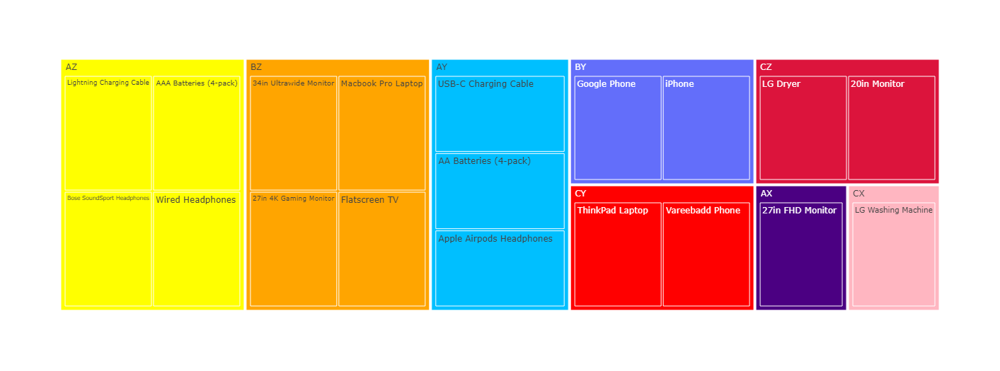

<h1>Tech Sales Analysis</h1>

After statistical analysis, basic value parameters such as minimum, maximum and average price and quantity were determined for each product sold during the year. This allowed the total profit on sales to be determined. 
Using the data on sales volume, individual item prices and total profit, an ABC analysis supplemented by XYZ can be performed to identify the products that contribute significantly to total profit. This analysis also measures the consistency of demand for each item, helping to identify products suitable for discontinuation and those requiring targeted marketing efforts to increase sales. 

<b>Time and Location Analysis</b> 
 
Given the different locations and timeframes of sales, it is interesting to examine the distribution of sales across cities and months. Interestingly, the distribution of sales by city is not directly correlated with population size; for example, the highest sales are not in New York, but in San Francisco, possibly influenced by its proximity to Silicon Valley. 
 
Examining the data and associated graphs, a pattern emerges: <b>peak sales occur in December</b>, likely fueled by holiday anticipation, with notable activity <b>also observed in October</b>. Conversely, lower sales are recorded during the summer months and in January, possibly influenced by vacation periods and post-holiday financial constraints. This analysis also prompts the exploration of a new hypothesis: the October sales spike may be related to Apple product releases. 
 
Sales were also analyzed by day of the week to identify peak periods. While the variations are subtle in the graph, Tuesday emerges as the busiest day, followed by a slight uptick on weekends, possibly driven by promotional activity. 
 
Another study looked at the timing of peak sales to optimize the launch of temporary ads and promotions. It appears that the majority of sales occur during lunchtime and after work hours, with nighttime sales tapering off as expected. 

<b>Hypothesis generation</b> 
1. After conducting basic statistical analysis, it became clear that profit and quantity have an inverse relationship: as profit increases, the number of units sold decreases, and similarly, higher prices correspond to fewer units sold. This observation supports the theory that fewer sales can lead to greater profit due to the effect of higher prices. Further testing is warranted to validate this theory. 
 
High sales volume does not guarantee high profitability of product sales. Therefore, an analysis was conducted to examine the relationship between sales volume and price for each product. It was found that low prices lead to high sales volume, while high prices lead to low sales volume. In addition, it is important to consider that products vary; accessories and batteries typically have low prices, while electronics have higher prices. In addition, accessories are more prone to breakage and loss and are generally always in demand. When comparing volume and profit for each product, it was found that products with higher prices generated the highest profit, while those with high volume generated lower profit. 
2. In analyzing the sales of Apple products, it was found that Apple products experience a peak in sales in December and October. October marks the annual release of new models after the September presentation, which may explain this trend. 

<h2>ABC analysis and XYZ</h2>

Using ABC and XYZ analysis, products have been grouped according to their sales performance. The top-performing product, which generates the highest revenue, is the <i>27in FHD Monitor</i>. At present, there are no specific recommendations for this item other than maintaining the current marketing strategy. Generally, products in category A do not require special promotions. Within the same category, there are products with varying demand levels and good contribution margins but relatively unstable demand: <i>AA Batteries (4-pack), USB-C Charging Cable, Apple Airpods Headphones</i>. The main strategy for these items is to increase sales, which necessitates enhancing their visibility to customers. The first two items are primarily accessories, and the most effective way to boost their sales is by offering them as add-ons with related products where appropriate. As for Airpods, featuring them prominently in catalogs could be an effective strategy.
 

The next category consists of items that sell reasonably well but experience sporadic demand, meaning their demand is highly unstable. These include <i>Bose SoundSport Headphones, Wired Headphones, Flatscreen TV, Google Phone, and iPhone</i>. For these items, a suitable strategy would be to fill the storefront on a marketplace with them and/or run promotions featuring them.
 

The following category comprises items with high revenue but low sales volume. These are typically high-priced items such as the <i>Macbook Pro Laptop and ThinkPad Laptop</i>. While they generate significant revenue, they lack in sales volume. To increase their sales, I would suggest offering discounts on related items with their purchase or providing a bonus for the next purchase of any item from the same brand or another item from the store.
 

The next category of products consists of items classified as group C, which may not yield significant profits but have relatively stable demand. These include the<i> Vareebadd Phone, LG Washing Machine, and LG Dryer</i>. Interestingly, despite being in the same category, the LG Washing Machine shows consistent and strong sales according to XYZ analysis, while the other two items have unstable sales patterns.
 
Let's focus on the LG products. Since the washing machine sells steadily but the dryer does not, one strategy could be to offer a discount on the dryer when purchasing the washing machine. Alternatively, offering free delivery and installation, along with an extended warranty, when both items are purchased together could also be effective. The best strategy would need to be determined through further analysis, but if there are no improvements in sales after implementing these changes and conducting additional analysis, discontinuing the sale of these two items might be advisable.
 
As for the Vareebadd Phone, it falls into category CC but within category Y, indicating potential for a loyalty program. Again, offering a bonus or discount for future purchases could be effective in encouraging customer loyalty and repeat purchases.
 

Based on all analyses, there is one product that stands out as a complete outsider: the <i>20in Monitor</i>. It's advisable to either discontinue its sale altogether or transition to a pre-order model where it's only available upon customer request. This approach ensures that resources are not allocated towards stocking a product with minimal demand while still catering to potential customers who specifically seek out this item.
 
Another strategy, specifically for Apple products, involves leveraging sales peaks coinciding with product launches. It would make sense to offer discounts on Apple products prior to new releases, such as in the summer or January. This strategy would incentivize customers to make purchases, even with discounted prices, which would prevent the products from falling into a lower revenue category while potentially increasing sales volume. Additionally, it would help clear out older models, aligning with Apple's strategy of refreshing their product lineup annually.
 

<i>All strategies should be examined with additional data and their performance should be studied to see if they are applicable. It's always necessary to evaluate what we implement to understand if it works and if it benefits us.</i>
 
